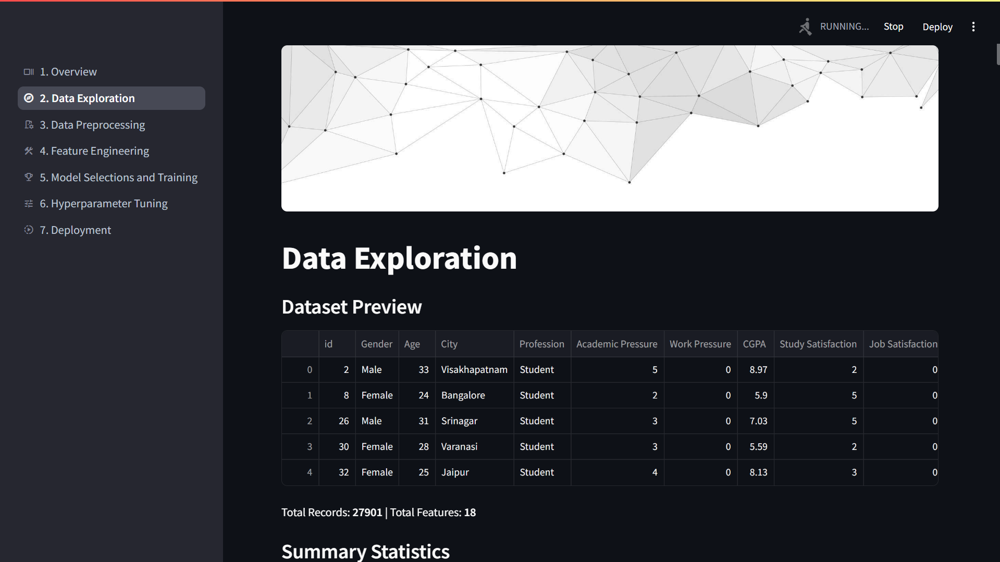
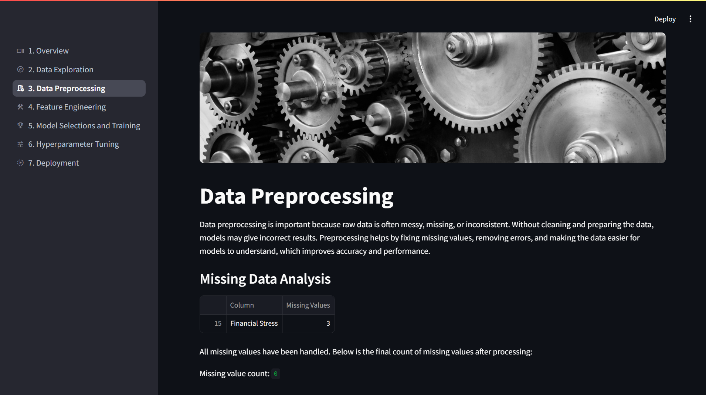
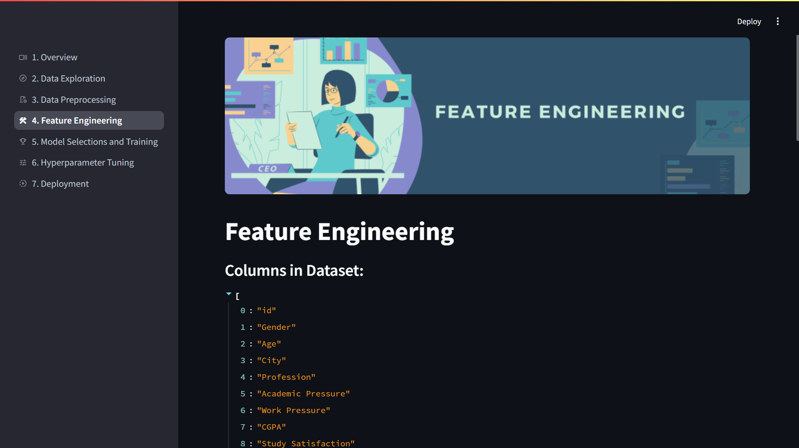
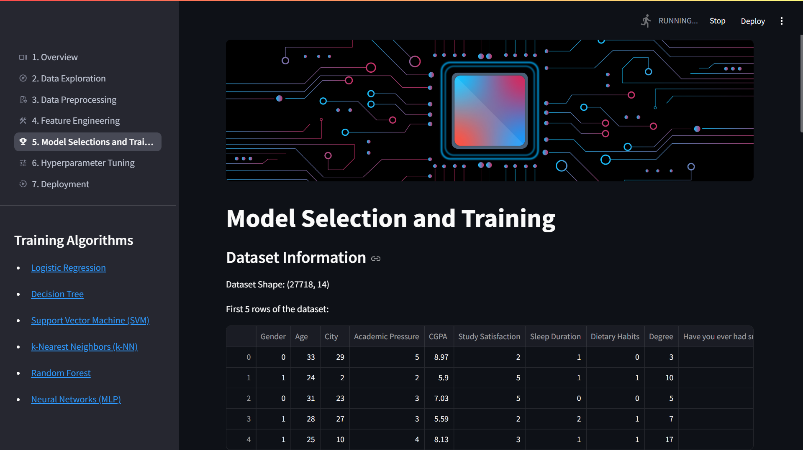
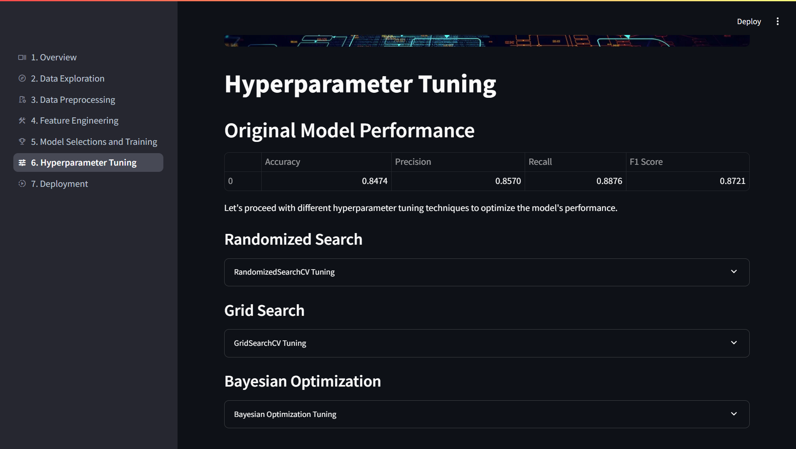
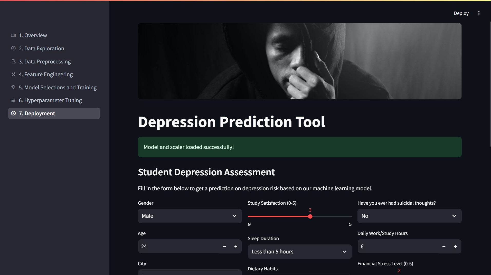

# Student Depression Prediction System

## Table of Contents
- [Overview & Demo](#overview)
- [Features](#features)
- [Dataset](#dataset)
- [Project Structure](#project-structure)
- [Installation](#installation)
- [Usage](#usage)
- [Project Chapters](#project-chapters)
  - [Data Exploration](#data-exploration)
  - [Data Preprocessing](#data-preprocessing)
  - [Feature Engineering](#feature-engineering)
  - [Model Selections & Training](#model-selections--training)
  - [Hyperparameter Tuning](#hyperparameter-tuning)
  - [Model Deployment](#model-deployment)
- [Model Performance](#model-performance)
- [Technologies Used](#technologies-used)
- [Future Improvements](#future-improvements)
- [Contributors](#contributors)
- [Acknowledgements](#acknowledgements)

## Overview
This project aims to predict depression risk in students using machine learning techniques. By analyzing various academic, lifestyle, and personal factors, the system identifies students who may be at risk of depression, enabling timely intervention and support.

The project implements a full machine learning pipeline from data preprocessing to model deployment as an interactive web application using Streamlit, making it accessible to users without technical expertise.

https://github.com/user-attachments/assets/1b6be219-738c-45a3-b91e-cc978b451010

## Features
- **Data Analysis & Preprocessing**: Comprehensive data cleaning, categorical encoding, and feature engineering
- **Model Training**: Logistic Regression , Decision Tree , SVM , KNN , Random Forest , Neural Network models for binary classification of depression risk
- **Hyperparameter Tuning**: Implementation of multiple tuning techniques (RandomizedSearchCV, GridSearchCV, and Bayesian Optimization)
- **Interactive Web Interface**: User-friendly Streamlit application for real-time predictions

## Dataset
The dataset contains information about students, including:
- Demographic information (age, gender, city)
- Academic factors (CGPA, academic pressure, study satisfaction)
- Lifestyle factors (sleep duration, dietary habits)
- Mental health indicators (suicidal thoughts, family history)

The target variable is the presence or absence of depression, making this a binary classification problem.

You can find the dataset on Kaggle: [Student Depression Dataset](https://www.kaggle.com/datasets/)

### Sample Data 

```csv
id,Gender,Age,City,Profession,Academic Pressure,Work Pressure,CGPA,Study Satisfaction,Job Satisfaction,Sleep Duration,Dietary Habits,Degree,Have you ever had suicidal thoughts ?,Work/Study Hours,Financial Stress,Family History of Mental Illness,Depression
2,Male,33.0,Visakhapatnam,Student,5.0,0.0,8.97,2.0,0.0,5-6 hours,Healthy,B.Pharm,Yes,3.0,1.0,No,1
8,Female,24.0,Bangalore,Student,2.0,0.0,5.9,5.0,0.0,5-6 hours,Moderate,BSc,No,3.0,2.0,Yes,0
26,Male,31.0,Srinagar,Student,3.0,0.0,7.03,5.0,0.0,Less than 5 hours,Healthy,BA,No,9.0,1.0,Yes,0
30,Female,28.0,Varanasi,Student,3.0,0.0,5.59,2.0,0.0,7-8 hours,Moderate,BCA,Yes,4.0,5.0,Yes,1

```
## Project Structure
```
StudentDepression/
├── assets/                      # Images and static files
├── data/                        # Data files
│   ├── Student_Depression_Dataset.csv              # Original dataset
│   ├── PreprocessedData.csv              # Preprocessed dataset
│   └── FeatureEngineeredData.csv # Feature Engineered dataset
├── models/                      # Saved machine learning models
├── chapters/                    # Project modules
│   ├── data_preprocessing.py   
│   ├── data_exploration.py   
│   ├── overview.py  
│   ├── feature_engineering.py
│   ├── model_selections_and_training.py
│   ├── hyperparameter_tuning.py
│   └── deployment.py
├── app.py                       # Main Streamlit application
├── requirements.txt             # Dependencies
└── README.md                    # This documentation
```

## Installation

1. Clone the repository:
    ```sh
    git clone https://github.com/RealChAuLa/StudentDepression.git
    cd StudentDepression
    ```

2. Create a virtual environment and activate it:
    ```sh
    python -m venv venv
    source venv/bin/activate  # On Windows use `venv\Scripts\activate`
    ```

3. Install the required packages:
    ```sh
    pip install -r requirements.txt
    ```

## Usage

1. Run the Streamlit application:
    ```sh
    streamlit run app.py
    ```

2. Open your web browser and navigate to `http://localhost:8501` to interact with the application.

## Project Chapters

### Data Exploration



Various visualizations are used to explore the dataset and understand the distribution and relationships between variables. Key visualizations include:
- Gender Distribution
- Depression Status
- Age Distribution
- Sleep Duration Distribution
- Academic Pressure
- Study Satisfaction Level
- Mental Illness In Family History
- Suicidal Thoughts Distribution
- Work/Study Hours Distribution
- CGPA Distribution
- Profession Distribution
- Degree Distribution
- Job Satisfaction Distribution

### Data Preprocessing
This chapter focuses on cleaning the dataset and performing exploratory data analysis to understand the distribution and relationships between variables.



Key preprocessing steps:
- Removal of duplicates and handling missing values
- Filtering to focus on the student population
- Removing outliers (students above 35 years)
- Eliminating uncommon categories with very few records

### Feature Engineering
This chapter transforms raw data into meaningful features for the machine learning model.



Feature engineering techniques:
- Encoding categorical variables (Gender, City, Sleep Duration, etc.)
- Normalizing numerical features
- Creating derived features where applicable

Encoding scheme examples:
- Gender: Male → 0, Female → 1
- Sleep Duration: Less than 5 hours → 0, 5-6 hours → 1, 7-8 hours → 2, More than 8 hours → 3
- Plus comprehensive encodings for cities, degrees, and other categorical variables

### Model Selections & Training
This chapter evaluates different machine learning algorithms and selects Logistic Regression as the most suitable for this binary classification task.



Model evaluation metrics:
- Accuracy
- Precision
- Recall
- F1 Score

The initial model provides a baseline performance before tuning.

### Hyperparameter Tuning
This chapter implements three different hyperparameter tuning approaches to optimize the model performance.



Tuning methods:
1. **RandomizedSearchCV**: Efficiently explores the hyperparameter space through random sampling
2. **GridSearchCV**: Exhaustively searches through a specified parameter grid
3. **Bayesian Optimization**: Uses probabilistic models to guide the search for optimal parameters

The performance of each method is compared to select the best configuration.

### Model Deployment
This chapter creates an interactive Streamlit web application that allows users to input their information and receive depression risk predictions and personalized recommendations.



Deployment features:
- User-friendly form interface
- Real-time predictions
- Risk visualization

## Technologies Used
- **Python**: Primary programming language
- **Pandas & NumPy**: Data manipulation and analysis
- **Scikit-learn**: Machine learning models and evaluation
- **Streamlit**: Web application deployment
- **Plotly**: Interactive data visualization
- **Joblib**: Model serialization
- **Scikit-optimize**: Bayesian optimization for hyperparameter tuning

## Future Improvements
- Expand the dataset to include more diverse student populations
- Implement more advanced models (e.g., ensemble methods)
- Add time-series analysis to track changes in depression risk over time
- Develop a notification system for high-risk individuals
- Integrate with university counseling services

## Contributors
- [Chalana Devinda](https://github.com/RealChAuLa)
- [Sasith Hansaka](https://github.com/sasithhansaka) 

---

**Disclaimer**: This tool provides an estimate based on statistical patterns and should not be used as a substitute for professional medical advice, diagnosis, or treatment. If you're experiencing mental health concerns, please consult with a qualified healthcare provider.